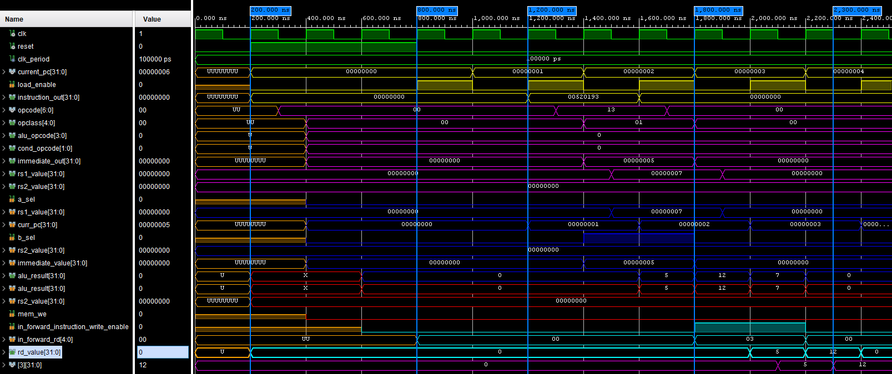
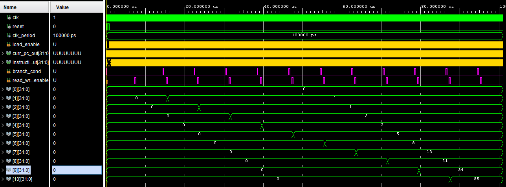

# RISC-V CPU Architecture in VHDL

A pipelined RISC-V CPU architecture designed and implemented in VHDL. The processor executes basic RISC-V instructions and computes the Fibonacci Series as a final verification test. Results can be visualized via the 7-segment LCD displays on a Nexys4 DDR board or inspected in simulation.

---

## 1. Project Overview

The primary goal of this project is to model a classical 5-stage RISC-V CPU in VHDL. To verify functional correctness, a Fibonacci Series algorithm was implemented in assembly to test branch logic, arithmetic operations, and memory writes. 

The project supports two main execution modes:
* **Simulation Mode:** Board-independent simulations (commit `c7af5a0`).
* **FPGA Implementation Mode:** Board-specific code including top-level processes for driving 7-segment displays and handling board push buttons (latest commit).

---

## 2. Pipeline Architecture & Stage Structure

The CPU is structured into a classical 5-stage pipeline, alongside a dedicated Control Unit.

### 2.1 Instruction Fetch (IF)
* Interfaces with Instruction Memory via clock (`clk`) and Program Counter (`pc`) signals to output instructions.
* Uses a `load_enable` signal from the Control Unit to update the Program Counter.
* Accepts feedback signals (`alu_result` and `branch`) from later pipeline stages to update execution flow.

### 2.2 Control Unit (CU)
* Determines when the next instruction can be fetched by updating the `load_enable` signal (set to `1` every two clock cycles to allow signal propagation).
* Analyzes instructions to generate register and memory write enables (`write_enable_register`, `write_enable_memory`) that forward down the pipeline.
* Operates in parallel with the Instruction Decode stage.

### 2.3 Instruction Decode (ID)
* Decodes the instruction using `funct3`, `funct7`, and `opcode` fields to set control signals for downstream stages.
* Extracts immediate values (`immediate_out`) and destination register addresses (`dest_register`) from the instruction.
* Reads source registers (`rs1`, `rs2`) from Register Memory (`read_register_1`, `read_register_2`).
* Receives feedback write signals (`write_value`, `write_address`, `write_enable`) from the Write Back stage to update register values.

### 2.4 Instruction Execute (EX)
* Features an Arithmetic Logic Unit (ALU) and a Comparator component.
* Uses multiplexers (`a_sel`, `b_sel`) to select ALU inputs between `curr_pc`, `rs1_value`, `immediate`, and `rs2_value`.
* Evaluates branch conditions using the Comparator and generates `branch_condition`.
* Feeds `alu_result` and `branch_condition` back to the IF stage for conditional jumps.

### 2.5 Memory Access (MEM)
* Handles read and write operations to Data Memory (RAM).
* Reads memory continuously every two clock cycles unless `memory_write_enable` is active.
* Forwards pipeline values (`alu_result`, destination registers, and write signals) to the next stage.

### 2.6 Write Back (WB)
* Outputs destination register addresses and values to be fed back into the Instruction Decode stage.
* Finalizes register updates for completed instructions.

---

## 3. Target Hardware (Nexys4 DDR Board)

The hardware implementation targets the **Nexys4 DDR Artix-7 FPGA**.

* **7-Segment Display (8 Digits):** Displays output data such as the incrementing Fibonacci Series, fetched instructions, or the Program Counter. Assembly code was tailored to store numbers in the same RAM register to stream them sequentially to the display.
* **Central Button (BTNC / N17):** Functions as the CPU system reset button. LED `H17` illuminates while the button is pressed.
* **Clock LED (K15):** Mirrors the active CPU clock signal.
* **Display Selection Switches (`V10`, `U11`, `U12`):**
  * `V10`: Selects the Program Counter for display.
  * `U11`: Selects the fetched instruction for display.
  * `U12`: Selects the Fibonacci Series output for display.
* **Clock Rate Switches (`J15`, `L16`):**
  * Set `J15 = 1` for a 1 Hz clock rate.
  * Set `L16 = 1` for a 100 Hz clock rate.
  * All other switch combinations default to a 100 MHz clock rate.

---

## 4. Setup, Installation & Usage

### 4.1 Prerequisites
* A VHDL simulation tool (e.g., Vivado Simulator, ModelSim).
* Xilinx Vivado (for FPGA synthesis and implementation).
* Nexys4 DDR Artix-7 FPGA board (optional for physical deployment).

### 4.2 Simulation Setup (Board-Independent)
1. Clone the repository and checkout commit `c7af5a0`:
   ```bash
   git clone [https://github.com/IGINOI/RISC-V_CPU.git](https://github.com/IGINOI/RISC-V_CPU.git)
   cd RISC-V_CPU
   git checkout c7af5a0
   ```
2. Load all VHDL source files into your simulation tool.
3. Run the top-level testbench to inspect pipeline waveforms.

### 4.3 FPGA Implementation (Nexys4 DDR)
1. Clone the repository and use the latest commit on the main branch:
   ```bash
   git clone [https://github.com/IGINOI/RISC-V_CPU.git](https://github.com/IGINOI/RISC-V_CPU.git)
   cd RISC-V_CPU
   ```
2. Open Vivado and import all VHDL source files along with the provided Nexys4 DDR constraint file (`.xdc`).
3. Run **Synthesis**, **Implementation**, and **Generate Bitstream**.
4. Program the Nexys4 DDR board via Hardware Manager.
5. **Operation:**
   * Select the desired clock speed using switches `J15` and `L16`.
   * Select display mode using switch `V10` (PC), `U11` (Instruction), or `U12` (Fibonacci).
   * Press and hold the central button **BTNC (N17)** for a couple of seconds to properly reset the CPU pipeline.

---

## 5. Verification & Final Results
This section provides simulation details for two test scenarios, verifying correct signal propagation and loop execution. Signals in the waveforms are color-coded to correspond to the pipeline stage in which they originate.

### 5.1 Addition Instruction Test

Image  waveform demonstrates the execution of a simple immediate addition: addi x3, x4, 5. The intent is to store in register x3 the sum of register x4 and the immediate value 5.

* **Green**: The Top file, initializing clock and reset signals. As seen, the Program Counter does not increment until the reset signal goes low.

* **Yellow**: Instruction Fetch (IF) stage. The `load_enable` signal (controlled by the Control Unit, not shown) enables fetching the next instruction, except when `reset` is active.

* **Violet**: Instruction Decode (ID) stage. This is where multiple signals are generated from the decoded instruction. Operands `rs1_value` and `immediate_out` are extracted and forwarded to the execution stage.

* **Blue**: Instruction Execute (EX) stage. The signals `a_sel` and `b_sel` select the correct inputs for the ALU, which subsequently computes the sum. The `alu_result` becomes the correct value at the marked timestamp of 1800ns.

* **Red**: Memory Access (MEM) stage. Since this operation does not read or write data memory, the signals are simply forwarded without interesting data modification.

* **Aqua**: Write Back (WB) stage. This stage shows the three critical feedback signals to the ID stage: the value to write, the target address (dest_register_address), and the write enable flag.

* **Violet** (Feedback Loop): The final step is shown in the ID stage again, where the computed value (12) is successfully written into register 3 of the memory.

### 5.2 Fibonacci Series Test



This waveform displays the complete execution of the Fibonacci Series test. Generating a single Fibonacci number requires multiple instructions, making the individual instruction details appear squeezed in this overall view. However, the waveform validates the functional loop behavior.
Fibonacci Verification Analysis:

* **Loop Behavior**: The waveform confirms that the code operates using branch instructions rather than simple sequential execution.

* **Branch Signal**: The `branch_cond` signal fires periodically. Critically, these timings coincide with data memory writes (`write_enable`), confirming iterative loop execution.

* **Initialization**: The first memory write happens before any branch firing. This correctly stores the first number of the sequence (`0`) before the first loop iteration begins.

* **Memory Storage**: The sequence of memory values successfully builds the expected Fibonacci sequence, validating the final storage integrity.